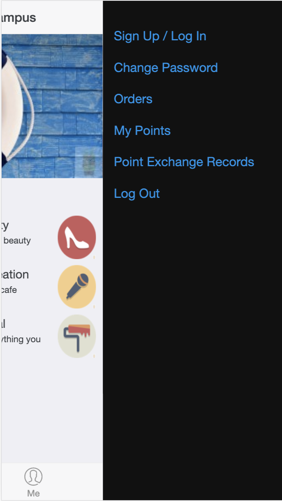
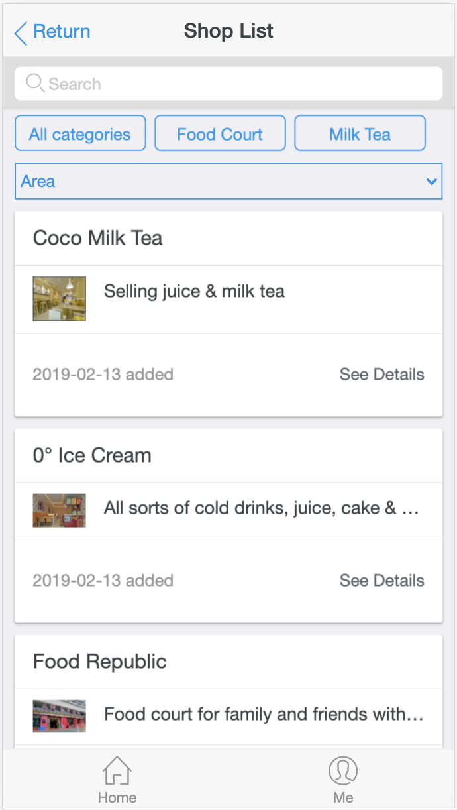
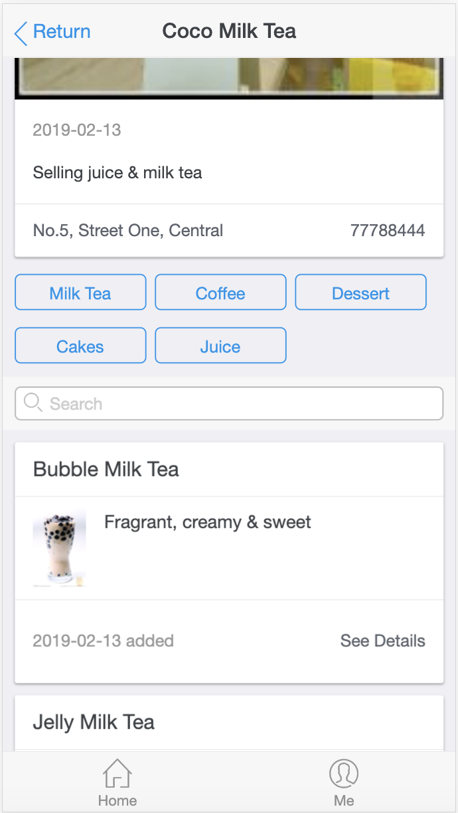
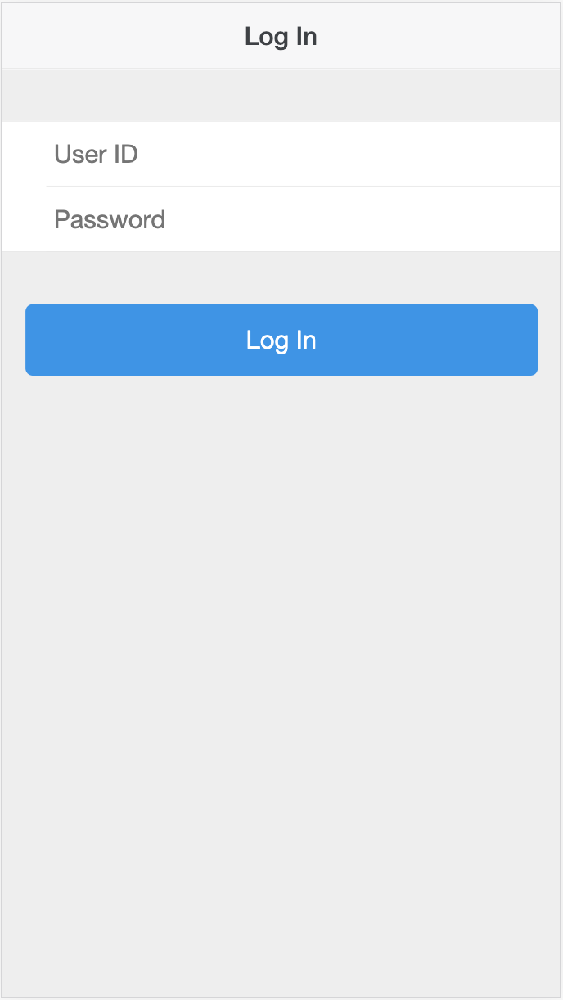
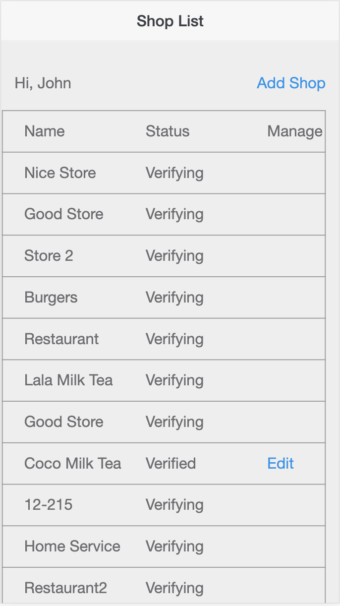
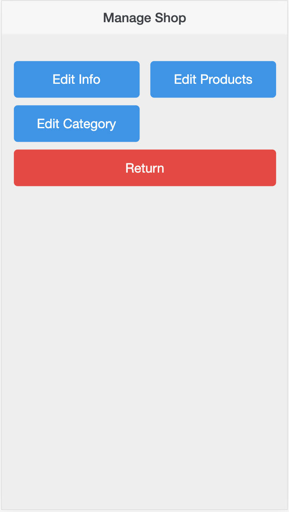
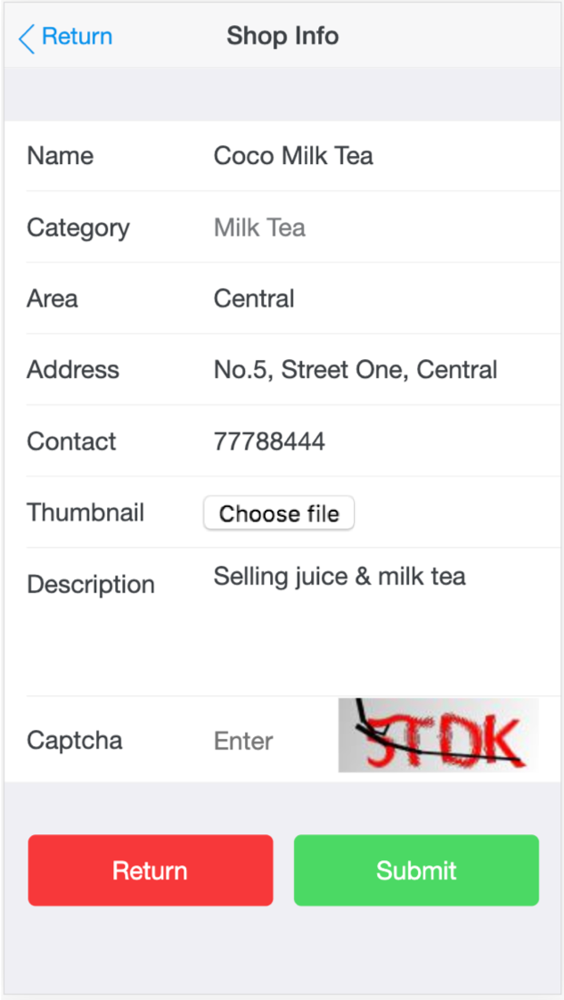

# campus-shop-platform
A web app that connects small businesses to students in the campus.

It is similar to basic version of yelp.com. It allows students in the campus to easily navigate to the local businesses they need and shop owners to showcase their shops. It has a sign up / log in system for customers and shop owners. It also has a point system which creates customer loyalty to the shops.

## Environment
* JDK 1.8
* IDE Intellij IDEA
* MySql 8.0
* Maven 4.0.0
* HTML H5
* Spring Boot: 2.1.6
* Deploy: Alibaba Cloud

## A front-end page for customers looks like this:

It has a headline sections which advertises latest/hotest shops in the campus. 
The section below shows all first-degree shop categories and their description. When cliking, it will fetch shops under that category from the database and jump to the page which will be shown later.
The 'All Shop' link will fetch and show all shops in the database without any filtering.
A super admin module can be used to edit the data of this page.
The 'Me' section shows some buttons for the user to manage the account.

This page shows the shop list for 'food' category. Users can filter results using the second degree category tags as well as the area drop-down list. Summary of each shop is shown as one shop card. When cliking, the page jumps to show details of the shop as below.

Details of the shop. Users can filtering products sold in the shop using the product category tags. When cliking on the product, the page jumps to details of the product.

## Shop manangement system for shop owner
Log In page. Any url request to this module without log in will be directed to this page by an interceptor.

After successful log in, the page will list all shops the user owned. User can either add shops or edit shops that are already verified.

User can edit shop info, products, and product category of the shop.

For example, for shop info:

The 'add shop' button will also jump to this page. The controller will check if the url has shop id. If it does, it will also fetch the shop details from the database to pre-fill the form.

The project is deployed to Alibaba Cloud server which runs CentOS 7.

Hope you like it❤️

